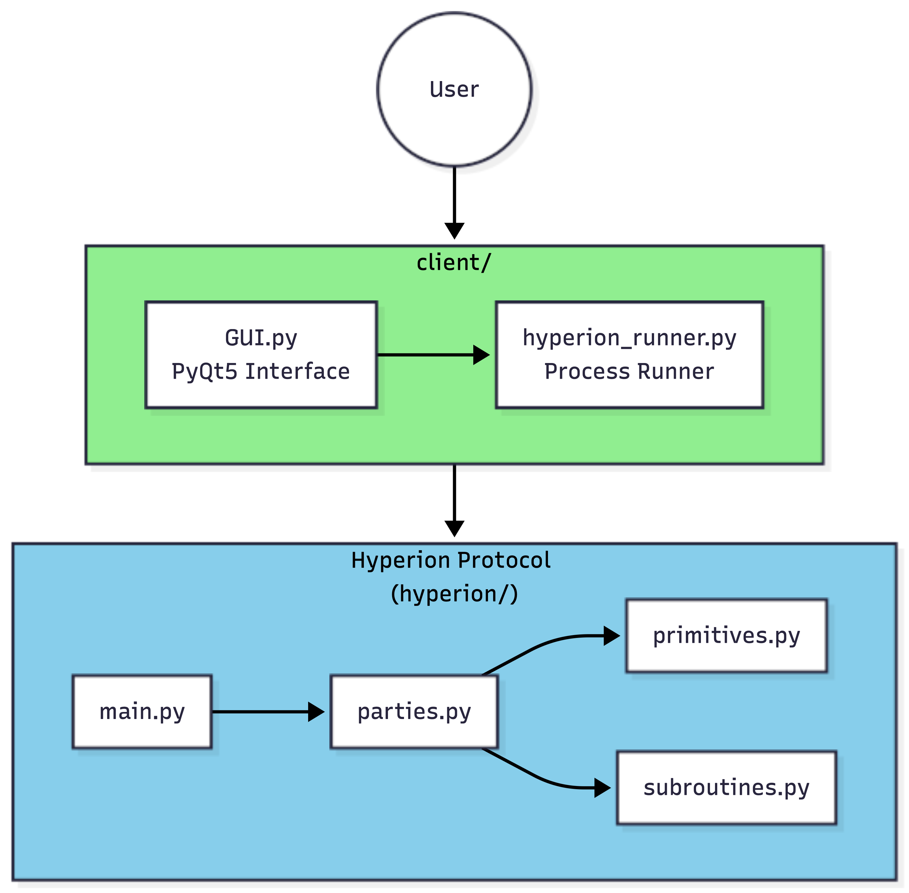
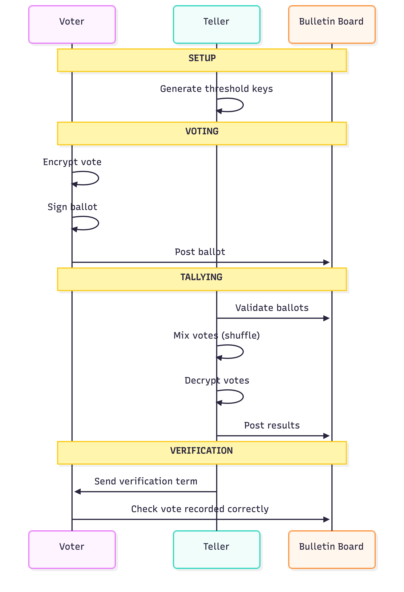
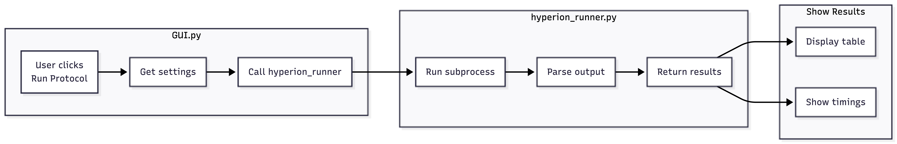
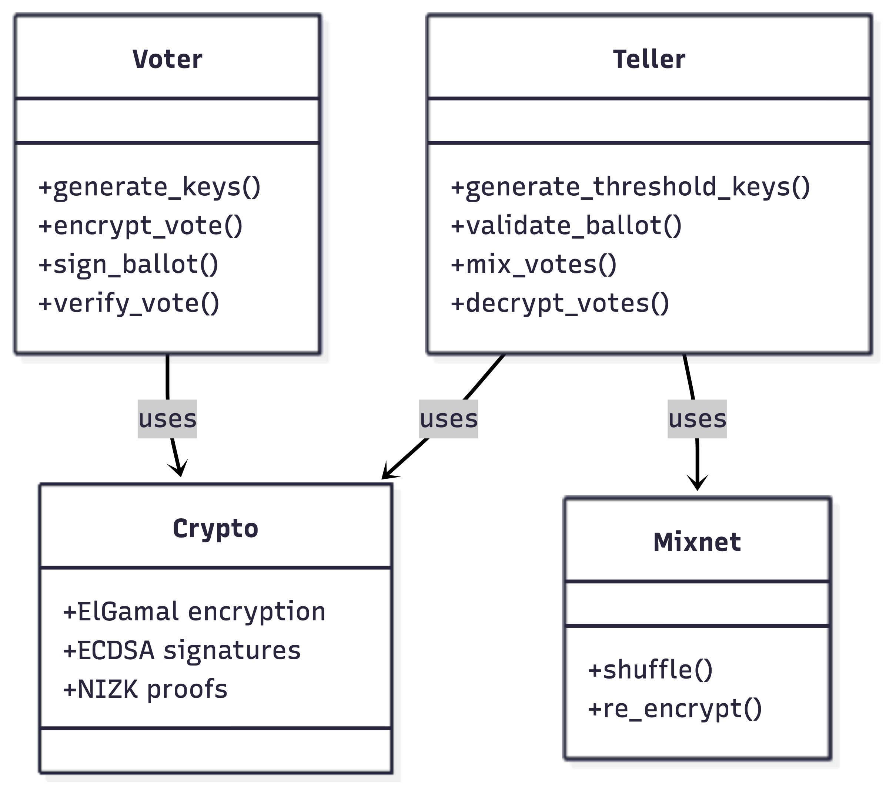

# Post-Quantum Secure E-Voting System

A PyQt5-based administrative interface for running and visualizing the [Hyperion voting protocol](https://github.com/hyperion-voting/hyperion) with post-quantum cryptography considerations.

## Overview

This project provides a graphical user interface for:

- **Running the Hyperion Protocol**: Execute the complete voting protocol
- **Viewing Results**: Display tallying results in an easy-to-read table
- **Understanding PQC Migration**: Reference table mapping classical to post-quantum cryptographic components

## Features

- One-click Hyperion protocol execution
- Bulletin board visualization
- Post-quantum cryptography mapping reference
- **ML-DSA-65 support** - optional PQC signatures

## Post-Quantum Cryptography

This project adds optional post-quantum security to Hyperion by replacing classical ECDSA signatures with **ML-DSA-65**.

Enable PQC mode via the checkbox in the GUI. The implementation:

- Uses `dilithium-py`
- Patches Hyperion's DSA class at runtime

## Prerequisites

- **Operating System**: Linux (tested on Fedora/Ubuntu) or macOS
- **Python**: Python 3.8 or higher
- **Git**: For cloning the Hyperion repository

## Setup

### 1. Run Setup Script

The setup script will automatically:

- Clone the Hyperion voting protocol repository
- Create a Python virtual environment (`.venv/`)
- Install all required dependencies (PyQt5, Hyperion requirements)
- Install the threshold cryptography library

```bash
chmod +x setup.sh
./setup.sh
```

## Architecture Diagrams

The `diagrams/` folder contains UML diagrams.

### Wrapper Architecture

Shows how our GUI wrapper integrates with the Hyperion protocol:

- **client/GUI.py** - interface for user interaction
- **client/hyperion_runner.py** - Subprocess runner that executes Hyperion and parses output
- **hyperion/** - The core Hyperion voting protocol



### Sequence Diagram

Illustrates the main phases of the Hyperion e-voting protocol:

1. **Setup** - Generate threshold cryptographic keys for tellers
2. **Voting** - Voters encrypt and sign their ballots
3. **Tallying** - Mixnet shuffling and threshold decryption
4. **Notification** - Send verification data to voters
5. **Verification** - Voters verify their vote was recorded correctly



### Protocol Flow

Shows the interaction between components during protocol execution:

- User triggers the protocol via GUI
- GUI calls hyperion_runner which spawns a subprocess
- Hyperion executes all protocol phases
- Results are parsed and displayed back to the user




### Class Diagram

Displays the main classes and their relationships:

- **Voter** - Handles key generation, vote encryption, and verification
- **Teller** - Manages threshold decryption and mixnet operations
- **AdminApp** - GUI controller class
- **HyperionRunner** - Protocol execution and output parsing



## License

This project is for research and educational purposes. Refer to the [Hyperion project license](https://github.com/hyperion-voting/hyperion) for the underlying protocol.

---

**⚠️ Note**: This is a demonstration GUI for the Hyperion protocol. The protocol simulates voters internally. This interface is designed for understanding and analyzing the cryptographic operations involved in receipt-free e-voting systems.
